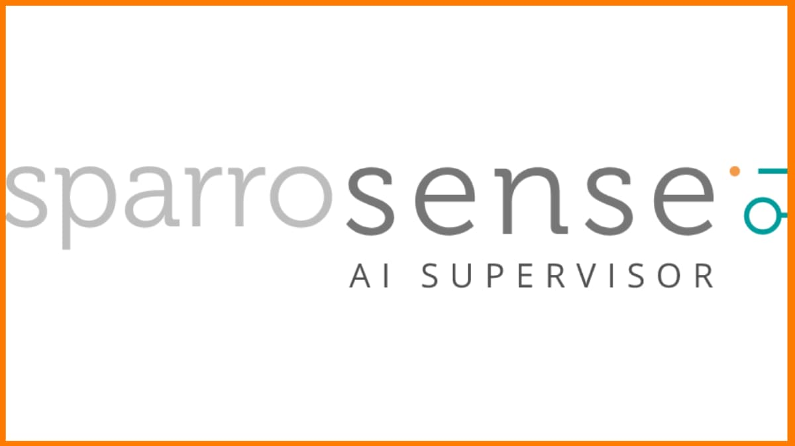
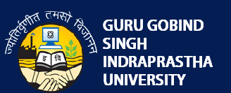

# greetings_visitor.py

```python
from greetings import Hello, Hi

hello = Hello("visitor")

hello.greet()
```

# About Me

```
A little about me:

And that's it.
```

# Work Experience

## **Machine Learning Engineer** _at_ Jumio


Vienna, Austria

_September 2021 - Present_

- Collaborating with the R&D team to build distributed cloud- based SaaS solutions for Identity Document Classification and Data Extraction.
- Building scalable ML models, algorithms, and analytics on financial datasets.
- Creating, evaluating and integrating new data pipelines to support complex data sets.
- Technical stack: PyTorch, Apache Airflow, Spark, AWS SageMaker, Docker, Jenkins

## **AI Research Intern** _at_ Orange


Lannion, France

_February 2021 - August 2021_

- Member of the Optical Networks team in Orange Labs.
- Conducted research on the state-of-the-art technology for fault alarms and fault localization in optical transport networks.
- Published a paper in the August 2021 issue at JOCN #TODO

## **Machine Learning Engineer Intern** _at_ MyScript


Nantes, France

_April 2020 - August 2020_

-Worked on Sequence-to-Sequence Learning with the Transformer architecture
-Addressed the problem of On-line Handwritten Text Recognition.
-Analyzed the performance of models based on Attention Mechanism and models based on Recurrence.
-Achieved 5.6% Character error rate (without Language Model) on IAM-OnDB Dataset.
-Technical Stack: Python, Pytorch, AWS Sagemaker, Git, Docker

## **Senior Software Developer** _at_ UST Global


Trivandrum, Kerala, India

_July 2018 - July 2019_

- Worked on building multiple Web Applications integrated with Machine Learning pipelines from scratch.
- Worked on multiple disciplines of Machine Learning including Natural Language Processing, Entity extraction from structured and unstructured documents, Object Detection, and Image Segmentation.
- Drafted POCs for multiple AI projects in association with the AI R&D team.
- Technical Stack: Python, Tensorflow, Keras, Scikit-learn, NLTK, SpaCy, Stanford CoreNLP, Django, Flask, JavaScript, Angular 6, PostgreSQL

## **Data Science Intern** _at_ LetsMD


Gurugram, India

_September 2017 - November 2017_

- Created pipelines to perform Exploratory Data Analysis and Data Cleaning techniques to maintain database quality.
- Analyzed the product data to automate the data quality analysis reports to monitor business and product performance.
- Implemented to completion multiple scripts to automate weekly and monthly Data Quality Analysis.
- Created scripts to visualize the database for better interpretation and managerial action.
- Technical Stack: Python, MySQL, Bash, Git

## **Data Analyst Intern** _at_ SparroSense



New Delhi, India

_July 2017 - August 2017_

- Worked on developing scripts for performing Exploratory Data Analysis and Data Visualization.
- Successfully created pipelines for Data Interpretation and Analysis using statistical techniques for providing ongoing reports.
- Technical Stack: Python, PostgreSQL

# Education

## **MS in Computer Science** _at_ Université Jean Monnet (Université de Lyon)


Saint Etienne, France

_2019 - 2021_

Specialization: Machine Learning and Data Mining

- Courses Undertaken:
  - Advanced Machine Learning
  - Deep Learning
  - Text Mining and Big Data
  - Computer Vision
  - Probabilistic Graphical Models
  - Data Analysis

## **B.Tech. (Engineering)** _at_ Guru Gobind Singh Indraprastha University



New Delhi, India

_2014 - 2018_

Specialization: Electronics and Communication

- Courses Undertaken:
  - Programming with C
  - Data Structures and Algorithms
  - Computer Organization and Architecture
  - Applied Mathematics
  - Database Management System

# Publications

## Satellite Image Analysis: A Review

IEEE ICECCT Feb 2019

[LINK](https://ieeexplore.ieee.org/document/8869481)

## Machine learning models for alarm classification and failure localization in optical transport networks

JOCN Aug 2021

[LINK](https://doi.org/10.1364/JOCN.457687)

# Certification

- Apache Airflow (Udemy)
- MLOps Specialization (deeplearning.ai) Neural Networks and Deep Learning (LinkedIn Learning)
- Python for Data Science and Machine Learning (Udemy)
- Python for Data Analytics (Datacamp) Statistics Foundations (Linkedin Learning) Flask (Udemy)
- Django (Django girls)
- JavaScript (Codeacademy)

# Languages

I speak English fluently.

Je parle un peu français.

# Volunteer Work

TEACH INDIA - The British Council, The Times of India

Spoken English Trainer

http://teachindia.net/